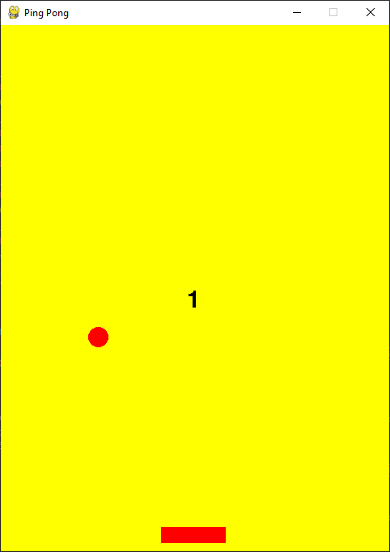

# Ping Pong

a ping pong game made in python with pygame. use your arrow keys to move your paddle.

# Download
to play the game, download the source code from the github release and run the `main.py` file or download and run the `game.exe` file.